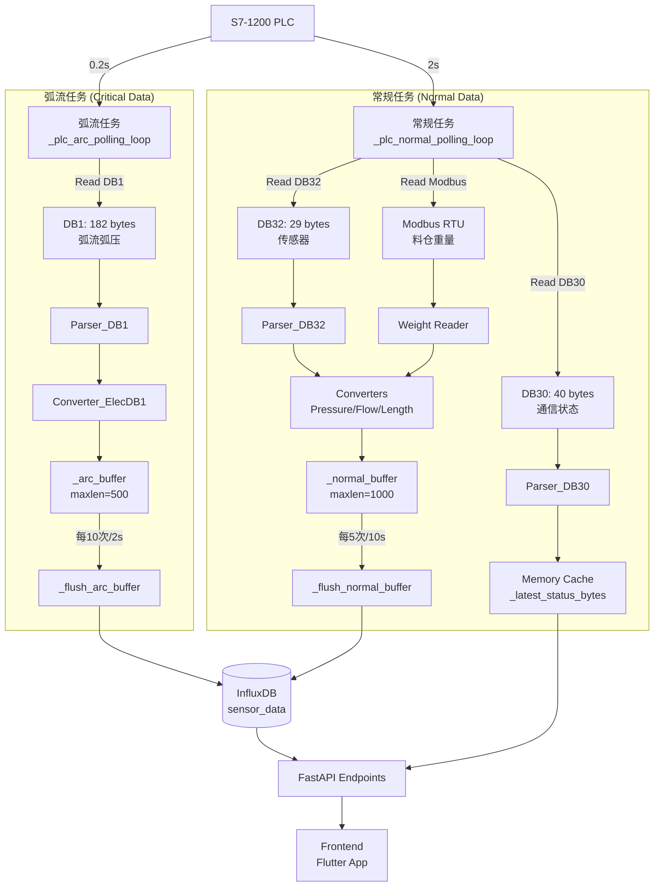

# 陶瓷电炉监控后端 - 架构文档

> **项目定位**: 基于 FastAPI + InfluxDB + Siemens S7-1200 的工业 IoT 监控系统  
> **核心特性**: 双速轮询、配置驱动、Mock/PLC 双模式、高可靠性

---

## 📋 目录

- [1. 架构概览](#1-架构概览)
- [2. 核心需求与实现](#2-核心需求与实现)
- [3. 数据流架构](#3-数据流架构)
- [4. 关键模块详解](#4-关键模块详解)
- [5. 配置系统](#5-配置系统)
- [6. API 接口设计](#6-api-接口设计)
- [7. 部署与运维](#7-部署与运维)

---

## 1. 架构概览

### 1.1 技术栈

| 层级           | 技术选型                           | 说明                         |
| -------------- | ---------------------------------- | ---------------------------- |
| **API 框架**   | FastAPI 0.115+                     | 异步高性能 Web 框架          |
| **时序数据库** | InfluxDB 2.7                       | 传感器数据存储与查询         |
| **PLC 通信**   | python-snap7 (S7 Protocol)         | 西门子 S7-1200 数据采集      |
| **配置管理**   | YAML (pyyaml) + Pydantic Settings  | 模块化配置，DRY 原则         |
| **并发模型**   | asyncio + asyncio.Task             | 双速轮询 (0.2s / 2s)         |
| **容器化**     | Docker + Docker Compose            | 开发/生产环境一致性          |
| **数据转换**   | Struct + Converter (物理量转换)    | 原始字节 → 工程单位          |

### 1.2 系统分层

```
┌─────────────────────────────────────────────────────────────┐
│                     FastAPI 路由层 (routers/)                │
│   /api/health  /api/furnace/*  /api/monitor/*  /api/realtime/*│
├─────────────────────────────────────────────────────────────┤
│                   业务逻辑层 (services/)                      │
│   FurnaceService  PollingService  FeedingService             │
├─────────────────────────────────────────────────────────────┤
│                    数据转换层 (tools/)                        │
│   Pressure  Flow  Length  ElecDB1  Furnace Converters        │
├─────────────────────────────────────────────────────────────┤
│                    PLC 通信层 (plc/)                          │
│   PLCManager  Parser(DB1/DB32/DB30/DB41)  ModbusReader       │
├─────────────────────────────────────────────────────────────┤
│                  存储层 (core/)                               │
│   InfluxDB Writer  AlarmStore  LocalCache                    │
└─────────────────────────────────────────────────────────────┘
                              ↕
                   ┌──────────────────────┐
                   │  S7-1200 PLC         │
                   │  - DB1  (弧流弧压)    │
                   │  - DB32 (传感器)      │
                   │  - DB30 (通信状态)    │
                   │  - DB41 (数据状态)    │
                   └──────────────────────┘
```

---

## 2. 核心需求与实现

### ✅ 需求 1: 双速轮询机制 (高频安全数据分离)

**业务背景**:  
电炉工作电流达数千安培，弧流/弧压异常可能导致爆炸风险，需要 **0.2 秒级** 实时监控。

**技术方案**:  
将数据采集拆分为两个独立 `asyncio.Task`:

| 任务类型       | 轮询频率 | 数据块            | 写入周期          | 前端请求频率 |
| -------------- | -------- | ----------------- | ----------------- | ------------ |
| **弧流弧压**   | 0.2s     | DB1 (182 bytes)   | 2s (10次批量写入) | 0.2s         |
| **常规传感器** | 2s       | DB32/DB30/Modbus  | 10s (5次批量写入) | 2.5s         |

**实现文件**:

- **核心逻辑**: [`app/services/polling_loops.py`](app/services/polling_loops.py) (281 行)
  - `_plc_arc_polling_loop()` - 真实 PLC 弧流 0.2s 轮询
  - `_mock_arc_polling_loop()` - Mock 模式弧流 0.2s 轮询
  - `_plc_normal_polling_loop()` - 真实 PLC 常规 2s 轮询
  - `_mock_normal_polling_loop()` - Mock 模式常规 2s 轮询
  - `_flush_arc_buffer()` - 弧流数据批量写入 (2s 周期)
  - `_flush_normal_buffer()` - 常规数据批量写入 (10s 周期)

- **任务管理**: [`app/services/polling_service.py`](app/services/polling_service.py) (1425 行)
  - `start_polling_with_batch()` - 启动双速轮询任务
  - `stop_polling()` - 优雅停止两个任务
  - 任务状态变量: `_arc_polling_task`, `_normal_polling_task`

- **配置参数**: [`config.py`](config.py) L38-39
  ```python
  polling_interval: int = 2  # 常规轮询 2 秒
  enable_polling: bool = False  # 手动触发启动
  ```

**技术细节**:
- **防止阻塞**: 两个任务独立运行，弧流任务不会被常规任务阻塞
- **批量写入**: 减少 InfluxDB I/O 压力 (弧流 10次/2s, 常规 5次/10s)
- **异常隔离**: 单个任务异常不影响另一个任务运行

---

### ✅ 需求 2: 配置驱动的 PLC 数据解析 (DRY 原则)

**业务背景**:  
PLC 内存布局复杂 (DB1 182字节, DB32 29字节)，硬编码偏移量难以维护。

**技术方案**:  
**三层配置架构** - 基础模块定义 → 设备配置 → 动态解析

```
┌──────────────────────────────────────────────────────┐
│  plc_modules.yaml (基础模块库 - 模块类型定义)         │
│  - InfraredDistance: {size: 4, fields: [HIGH, LOW]}  │
│  - PressureSensor: {size: 4, fields: [HIGH, LOW]}    │
│  - ArcCurrentSensor: {size: 4, fields: [HIGH, LOW]}  │
└──────────────────────────────────────────────────────┘
                      ↓ 引用 (module_ref)
┌──────────────────────────────────────────────────────┐
│  config_L3_P2_F2_C4_db32.yaml (DB32 具体配置)        │
│  modules:                                             │
│    - name: LENTH_1                                    │
│      module_ref: InfraredDistance                     │
│      offset: 0                                        │
│    - name: PD_WP_1                                    │
│      module_ref: PressureSensor                       │
│      offset: 4                                        │
└──────────────────────────────────────────────────────┘
                      ↓ 解析
┌──────────────────────────────────────────────────────┐
│  Parser 动态解析 → Python Dict                        │
│  {'LENTH_1_HIGH': 1234, 'LENTH_1_LOW': 5678, ...}   │
└──────────────────────────────────────────────────────┘
```

**实现文件**:

- **配置文件**:
  - [`configs/plc_modules.yaml`](configs/plc_modules.yaml) - 基础模块定义 (Type Library)
  - [`configs/db_mappings.yaml`](configs/db_mappings.yaml) - DB 块总映射表
  - [`configs/config_L3_P2_F2_C4_db32.yaml`](configs/config_L3_P2_F2_C4_db32.yaml) - DB32 传感器配置
  - [`configs/config_vw_data_db1.yaml`](configs/config_vw_data_db1.yaml) - DB1 弧流弧压配置
  - [`configs/status_L3_P2_F2_C4_db30.yaml`](configs/status_L3_P2_F2_C4_db30.yaml) - DB30 通信状态配置
  - [`configs/status_db41.yaml`](configs/status_db41.yaml) - DB41 数据状态配置

- **解析器**:
  - [`app/plc/parser_config_db32.py`](app/plc/parser_config_db32.py) - DB32 配置驱动解析器
  - [`app/plc/parser_config_db1.py`](app/plc/parser_config_db1.py) - DB1 配置驱动解析器
  - [`app/plc/parser_status_db30.py`](app/plc/parser_status_db30.py) - DB30 状态解析器
  - [`app/plc/parser_status_db41.py`](app/plc/parser_status_db41.py) - DB41 数据状态解析器

**优势**:
- **新增设备**: 仅需在 YAML 中添加配置，无需修改代码
- **调试友好**: 偏移量错误时，直接修改 YAML 重启即可
- **复用性强**: `plc_modules.yaml` 可跨项目复用

---

### ✅ 需求 3: Mock/PLC 双模式切换 (前端独立开发)

**业务背景**:  
开发环境无法接入真实 PLC，前端需要模拟数据进行 UI 开发。

**技术方案**:  
通过环境变量 `MOCK_MODE` 切换数据源，保持 API 接口一致。

**实现文件**:

- **配置开关**: [`config.py`](config.py) L20-22
  ```python
  # True: Mock 数据 (开发/测试)
  # False: 真实 PLC (生产环境)
  mock_mode: bool = True
  ```

- **Mock 数据生成**: [`app/services/polling_service.py`](app/services/polling_service.py)
  - `_generate_mock_db1_data()` - Mock 弧流弧压 (L850-900)
  - `_generate_mock_db32_data()` - Mock 传感器数据 (L920-970)
  - `_generate_mock_db30_data()` - Mock 通信状态 (L990-1040)
  - `_generate_mock_db41_data()` - Mock 数据状态 (L1060-1100)
  - `_generate_mock_weight_data()` - Mock 料仓重量 (L1120-1150)

- **Docker 编排**: [`docker-compose.yml`](docker-compose.yml)
  ```yaml
  profiles:
    - mock         # 开发环境: docker compose --profile mock up -d
    - production   # 生产环境: docker compose --profile production up -d
  ```

**切换方式**:
```bash
# 方式 1: 环境变量
export MOCK_MODE=true
docker compose up -d

# 方式 2: Docker Compose Profile
docker compose --profile mock up -d         # Mock 模式
docker compose --profile production up -d   # PLC 模式
```

---

### ✅ 需求 4: 物理量转换与单位标准化

**业务背景**:  
PLC 存储的是原始 ADC 值 (如 WORD 0-65535)，需转换为工程单位 (kPa, m³/h, A, V)。

**技术方案**:  
**Converter 层** 负责 `原始值 → 物理量` 转换，解耦解析与转换逻辑。

**实现文件**:

- [`app/tools/converter_pressure.py`](app/tools/converter_pressure.py) (302 行)
  - **功能**: 水压传感器转换 (WORD → kPa)
  - **公式**: `physical_value = (HIGH * 65536 + LOW) * 0.01`
  - **单位**: kPa (千帕)
  - **量程**: 0-1000 kPa

- [`app/tools/converter_flow.py`](app/tools/converter_flow.py) (243 行)
  - **功能**: 流量传感器转换 (WORD → m³/h)
  - **公式**: `flow = (HIGH * 65536 + LOW) * 1.0`
  - **单位**: m³/h (立方米每小时)
  - **量程**: 0-10000 m³/h

- [`app/tools/converter_length.py`](app/tools/converter_length.py)
  - **功能**: 红外测距转换 (WORD → mm)
  - **公式**: `distance = (HIGH * 65536 + LOW) * 0.1`
  - **单位**: mm (毫米)

- [`app/tools/converter_elec_db1.py`](app/tools/converter_elec_db1.py)
  - **功能**: DB1 弧流弧压转换 (WORD → A, V)
  - **公式**: 
    - 弧流: `current = (HIGH * 65536 + LOW) * 0.01 * 10` (A)
    - 弧压: `voltage = (HIGH * 65536 + LOW) * 0.01 * 10` (V)
  - **归一化**: 分两步 (先归一化到 0-1, 再缩放)

- [`app/tools/converter_furnace.py`](app/tools/converter_furnace.py)
  - **功能**: 电炉综合数据转换
  - **集成**: 调用上述所有 Converter

**技术细节**:
- **大端序处理**: S7-1200 使用 Big Endian
  ```python
  struct.unpack('>H', bytes)  # WORD (2 bytes)
  struct.unpack('>f', bytes)  # REAL (4 bytes)
  ```
- **异常值处理**: 超量程时返回 `None` 或 `-999`
- **精度控制**: 保留 1-2 位小数

---

### ✅ 需求 5: 高可靠 PLC 连接管理

**业务背景**:  
工控机可能断电、PLC 网络不稳定，需要自动重连机制。

**技术方案**:  
**单例 PLCManager** + **连接池** + **指数退避重连**

**实现文件**:

- [`app/plc/plc_manager.py`](app/plc/plc_manager.py) (约 300 行)
  - **单例模式**: `get_plc_manager()` 全局唯一实例
  - **连接管理**: 
    - `connect()` - 带重试的连接逻辑
    - `disconnect()` - 优雅断开
    - `reconnect()` - 强制重连
  - **健康检查**: 
    - `get_status()` - 返回连接状态、最后通信时间
    - `is_connected()` - 快速状态检查
  - **读写操作**:
    - `read_db(db_number, start, size)` - 读取 DB 块
    - `write_db(db_number, start, data)` - 写入 DB 块

**重连策略**:
```python
# 指数退避重连 (1s → 2s → 4s → 8s → 最大 30s)
retry_delay = min(2 ** retry_count, 30)
await asyncio.sleep(retry_delay)
```

**连接状态监控**:
- **API 端点**: `GET /api/health` - 包含 PLC 连接状态
- **统计指标**: 连接次数、失败次数、最后通信时间

---

### ✅ 需求 6: InfluxDB 批量写入优化

**业务背景**:  
高频轮询产生大量数据点 (0.2s × 6 弧流值 = 30点/秒)，频繁写入影响性能。

**技术方案**:  
**双缓冲区 + 批量提交** - 减少 I/O 开销

| 缓冲区类型     | 批量大小 | 写入周期 | 预期点数/次 |
| -------------- | -------- | -------- | ----------- |
| `_arc_buffer`  | 10 次    | 2 秒     | 60 点       |
| `_normal_buffer` | 5 次   | 10 秒    | 20-30 点    |

**实现文件**:

- **批量写入**: [`app/core/influxdb.py`](app/core/influxdb.py)
  - `write_points_batch(points: List[Point])` - 批量写入
  - `build_point(measurement, tags, fields, time)` - 构建 InfluxDB Point

- **缓冲区管理**: [`app/services/polling_loops.py`](app/services/polling_loops.py)
  - `_flush_arc_buffer()` - 弧流数据批量提交
  - `_flush_normal_buffer()` - 常规数据批量提交

**性能对比**:
```
单次写入:  30 点/秒 × 3600秒 = 108,000 次 I/O/小时
批量写入:  1 次/2秒 × 3600秒 = 1,800 次 I/O/小时
优化比例:  60 倍 I/O 减少
```

---

### ✅ 需求 7: Modbus RTU 料仓重量采集

**业务背景**:  
料仓称重传感器使用 Modbus RTU 协议 (RS485)，需独立读取。

**技术方案**:  
**串口通信** + **重量数据融合**

**实现文件**:

- [`app/tools/operation_modbus_weight_reader.py`](app/tools/operation_modbus_weight_reader.py)
  - `read_hopper_weight(port, baudrate)` - 读取料仓重量
  - 协议: Modbus RTU, 9600 baud
  - 寄存器: 0x0000 (功能码 0x03)

- **数据处理**: [`app/services/polling_service.py`](app/services/polling_service.py)
  - `_process_weight_data(weight_data)` - 将重量数据写入 InfluxDB
  - 集成到 `_plc_normal_polling_loop()` 的 2s 轮询中

**配置**:
```python
MODBUS_PORT = "COM3"  # Windows
MODBUS_BAUDRATE = 9600
```

---

### ✅ 需求 8: 状态数据缓存 (非持久化)

**业务背景**:  
通信状态 (DB30) 和数据状态 (DB41) 仅需实时查询，不需要历史存储。

**技术方案**:  
**内存缓存** - 仅保留最新值

**实现文件**:

- **缓存管理**: [`app/services/polling_service.py`](app/services/polling_service.py)
  ```python
  _latest_status_bytes: Dict[str, bytes] = {}      # DB30 原始字节
  _latest_db41_parsed: Dict[str, Any] = {}         # DB41 解析结果
  ```

- **状态解析**: 
  - [`app/plc/parser_status_db30.py`](app/plc/parser_status_db30.py) - DB30 通信状态
  - [`app/plc/parser_status_db41.py`](app/plc/parser_status_db41.py) - DB41 数据状态

- **API 查询**:
  - `GET /api/monitor/status` - 返回 DB30 通信状态
  - `GET /api/realtime/db41` - 返回 DB41 数据状态

**缓存更新**:
- **频率**: 随常规轮询 (2s) 更新
- **存储**: 内存 Dict (不写入 InfluxDB)
- **线程安全**: 使用 `asyncio` 协程，无需锁

---

## 3. 数据流架构

### 3.1 双速轮询数据流



### 3.2 Mock 模式数据流

```
┌─────────────────────────────────────────────────────────┐
│  Mock 模式: MOCK_MODE=true                               │
├─────────────────────────────────────────────────────────┤
│  _mock_arc_polling_loop()     (0.2s)                    │
│    ↓                                                     │
│  _generate_mock_db1_data()    (随机弧流/弧压)           │
│    ↓                                                     │
│  _process_arc_data()          (与 PLC 模式共享)         │
│    ↓                                                     │
│  _arc_buffer → _flush_arc_buffer() → InfluxDB           │
├─────────────────────────────────────────────────────────┤
│  _mock_normal_polling_loop()  (2s)                      │
│    ↓                                                     │
│  _generate_mock_db32_data()   (随机传感器值)            │
│  _generate_mock_db30_data()   (固定通信状态)            │
│  _generate_mock_weight_data() (随机重量)                │
│    ↓                                                     │
│  _process_modbus_data()       (与 PLC 模式共享)         │
│  _process_status_data()       (与 PLC 模式共享)         │
│    ↓                                                     │
│  _normal_buffer → _flush_normal_buffer() → InfluxDB     │
└─────────────────────────────────────────────────────────┘
```

---

## 4. 关键模块详解

### 4.1 服务层 (app/services/)

| 文件                    | 行数  | 核心功能                          | 关键函数                                      |
| ----------------------- | ----- | --------------------------------- | --------------------------------------------- |
| `polling_service.py`    | 1425  | 轮询任务管理、数据处理、统计      | `start_polling_with_batch()`, `stop_polling()`, `_process_arc_data()` |
| `polling_loops.py`      | 281   | 双速轮询循环 (Mock + PLC)         | `_plc_arc_polling_loop()`, `_plc_normal_polling_loop()`, `_flush_arc_buffer()` |
| `furnace_service.py`    | ~200  | 电炉业务逻辑、历史数据查询        | `get_realtime_data()`, `get_history()`        |
| `feeding_service.py`    | ~150  | 料仓下料服务                      | `get_feeding_status()`                        |

### 4.2 PLC 通信层 (app/plc/)

| 文件                    | 行数  | 核心功能                          | 配置文件依赖                             |
| ----------------------- | ----- | --------------------------------- | ---------------------------------------- |
| `plc_manager.py`        | 300   | 单例 PLC 连接管理、重连机制       | `config.py` (plc_ip, plc_port)           |
| `parser_config_db1.py`  | 250   | DB1 弧流弧压解析 (配置驱动)       | `config_vw_data_db1.yaml`                |
| `parser_config_db32.py` | 280   | DB32 传感器解析 (配置驱动)        | `config_L3_P2_F2_C4_db32.yaml`           |
| `parser_status_db30.py` | 200   | DB30 通信状态解析                 | `status_L3_P2_F2_C4_db30.yaml`           |
| `parser_status_db41.py` | 180   | DB41 数据状态解析                 | `status_db41.yaml`                       |

### 4.3 数据转换层 (app/tools/)

| 文件                          | 行数  | 转换功能                     | 输入格式        | 输出单位 |
| ----------------------------- | ----- | ---------------------------- | --------------- | -------- |
| `converter_pressure.py`       | 302   | 水压传感器                   | WORD (HIGH/LOW) | kPa      |
| `converter_flow.py`           | 243   | 流量传感器                   | WORD (HIGH/LOW) | m³/h     |
| `converter_length.py`         | 180   | 红外测距                     | WORD (HIGH/LOW) | mm       |
| `converter_elec_db1.py`       | 320   | 弧流弧压 (归一化 + 缩放)     | WORD (HIGH/LOW) | A, V     |
| `converter_furnace.py`        | 250   | 电炉综合数据 (集成所有转换)  | Dict            | Dict     |
| `operation_modbus_weight_reader.py` | 150 | Modbus RTU 料仓重量    | RS485 Serial    | kg       |

### 4.4 存储层 (app/core/)

| 文件              | 行数  | 核心功能                          | 关键函数                              |
| ----------------- | ----- | --------------------------------- | ------------------------------------- |
| `influxdb.py`     | 350   | InfluxDB 读写封装                 | `write_points_batch()`, `query_range()` |
| `alarm_store.py`  | 200   | 报警数据存储 (SQLite)             | `save_alarm()`, `get_alarms()`        |

### 4.5 路由层 (app/routers/)

| 文件          | 端点                           | 功能                          |
| ------------- | ------------------------------ | ----------------------------- |
| `health.py`   | `GET /api/health`              | 系统健康检查 (PLC/InfluxDB 状态) |
| `furnace.py`  | `GET /api/furnace/realtime`    | 所有电炉实时数据              |
|               | `GET /api/furnace/realtime/{id}` | 单个电炉实时数据            |
|               | `GET /api/furnace/history`     | 历史数据查询                  |
| `monitor.py`  | `GET /api/monitor/status`      | 通信状态 (DB30)               |
|               | `GET /api/realtime/db41`       | 数据状态 (DB41)               |

---

## 5. 配置系统

### 5.1 配置文件层级

```
configs/
├── db_mappings.yaml          # [总映射] DB 块 → 配置文件映射
├── plc_modules.yaml          # [基础库] 模块类型定义 (DRY)
├── config_vw_data_db1.yaml   # [DB1] 弧流弧压配置
├── config_L3_P2_F2_C4_db32.yaml  # [DB32] 传感器配置
├── status_L3_P2_F2_C4_db30.yaml  # [DB30] 通信状态配置
└── status_db41.yaml          # [DB41] 数据状态配置
```

### 5.2 配置引用机制

**示例: 压力传感器配置**

```yaml
# plc_modules.yaml (基础模块定义)
modules:
  PressureSensor:
    size: 4
    fields:
      - name: HIGH
        type: WORD
        offset: 0
      - name: LOW
        type: WORD
        offset: 2
    description: "水压传感器 (0-1000 kPa)"

---
# config_L3_P2_F2_C4_db32.yaml (实例化)
modules:
  - name: PD_WP_1           # 实例名称
    module_ref: PressureSensor  # 引用基础模块
    offset: 4               # DB32 中的起始偏移量
    description: "1号水压传感器"
```

### 5.3 配置参数说明

| 配置项      | 说明                        | 示例值                           |
| ----------- | --------------------------- | -------------------------------- |
| `name`      | 实例名称 (唯一标识)         | `PD_WP_1`, `LENTH_1`             |
| `module_ref`| 引用的基础模块名            | `PressureSensor`, `InfraredDistance` |
| `offset`    | DB 块内偏移量 (字节)        | 0, 4, 8                          |
| `size`      | 数据大小 (字节)             | 4 (WORD×2), 8 (REAL×2)           |
| `type`      | 字段类型                    | `WORD`, `REAL`, `BOOL`, `BYTE`   |

---

## 6. API 接口设计

### 6.1 健康检查 API

**端点**: `GET /api/health`  
**功能**: 系统状态监控  
**返回示例**:
```json
{
  "status": "healthy",
  "timestamp": "2026-01-22T14:30:00Z",
  "plc": {
    "connected": true,
    "last_communication": "2026-01-22T14:29:58Z",
    "connection_count": 1,
    "failure_count": 0
  },
  "influxdb": {
    "connected": true,
    "bucket": "sensor_data"
  },
  "polling": {
    "arc_running": true,
    "normal_running": true,
    "total_polls": 15234,
    "arc_buffer_size": 45,
    "normal_buffer_size": 12
  }
}
```

### 6.2 实时数据 API

**端点**: `GET /api/furnace/realtime`  
**功能**: 获取所有电炉实时数据  
**返回示例**:
```json
{
  "timestamp": "2026-01-22T14:30:00Z",
  "furnace_id": "L3_P2_F2_C4",
  "arc_data": {
    "phase_A": {"current": 1234.5, "voltage": 456.7},
    "phase_B": {"current": 1230.2, "voltage": 455.3},
    "phase_C": {"current": 1240.8, "voltage": 458.1}
  },
  "sensors": {
    "infrared_distance": [123.4, 234.5, 345.6],
    "water_pressure": [410.5, 415.2],
    "water_flow": [125.3, 130.7]
  },
  "hopper_weight": {
    "current": 523.4,
    "unit": "kg"
  }
}
```

### 6.3 历史数据查询 API

**端点**: `GET /api/furnace/history?start=2026-01-22T00:00:00Z&end=2026-01-22T23:59:59Z&field=arc_current_A`  
**功能**: 查询指定时间范围的历史数据  
**参数**:
- `start`: 开始时间 (ISO 8601)
- `end`: 结束时间 (ISO 8601)
- `field`: 字段名 (可选, 多字段用逗号分隔)
- `device_id`: 设备 ID (可选)

**返回示例**:
```json
{
  "data": [
    {
      "time": "2026-01-22T14:30:00Z",
      "arc_current_A": 1234.5,
      "arc_voltage_V": 456.7
    },
    {
      "time": "2026-01-22T14:30:02Z",
      "arc_current_A": 1230.2,
      "arc_voltage_V": 455.3
    }
  ],
  "count": 2,
  "query_time_ms": 45
}
```

### 6.4 通信状态 API

**端点**: `GET /api/monitor/status`  
**功能**: 获取 PLC 通信状态 (DB30)  
**返回示例**:
```json
{
  "timestamp": "2026-01-22T14:30:00Z",
  "db30": {
    "infrared_1": {"status": "online", "last_update": "2026-01-22T14:29:59Z"},
    "infrared_2": {"status": "online", "last_update": "2026-01-22T14:29:59Z"},
    "pressure_1": {"status": "online", "last_update": "2026-01-22T14:29:59Z"},
    "modbus_rtu": {"status": "online", "last_update": "2026-01-22T14:29:58Z"}
  }
}
```

---

## 7. 部署与运维

### 7.1 Docker 部署

**开发环境 (Mock 模式)**:
```bash
# 启动 Mock 服务 (无需 PLC)
docker compose --profile mock up -d --build

# 查看日志
docker compose logs -f backend

# 停止服务
docker compose --profile mock down
```

**生产环境 (PLC 模式)**:
```bash
# 启动真实 PLC 连接
docker compose --profile production up -d --build

# 实时监控日志
docker compose logs -f --tail=100 backend

# 重启服务
docker compose restart backend
```

### 7.2 端口分配

| 服务            | 内部端口 | 外部端口 | 说明                     |
| --------------- | -------- | -------- | ------------------------ |
| Backend API     | 8080     | **8082** | FastAPI 服务             |
| InfluxDB        | 8086     | **8088** | 时序数据库               |
| InfluxDB UI     | 8086     | 8088     | InfluxDB 管理界面        |

### 7.3 离线更新流程

**1. 开发机打包镜像**:
```bash
# 构建镜像
docker build -t furnace-backend:1.2.0 .

# 导出镜像包
docker save -o deploy/1.2.0/furnace-backend_1.2.0.tar furnace-backend:1.2.0
```

**2. 工控机部署**:
```powershell
# 进入部署目录
cd D:\deploy\1.2.0

# 停止旧服务 (保留数据卷)
docker rm -f furnace-backend furnace-influxdb

# 加载新镜像
docker load -i furnace-backend_1.2.0.tar

# 启动新服务
docker compose --profile production up -d

# 验证日志
docker compose logs -f --tail=50 backend
```

### 7.4 日志查看

**实时日志**:
```bash
docker compose logs -f backend
```

**筛选日志**:
```bash
# 查看弧流轮询日志
docker compose logs backend | grep "弧流轮询"

# 查看错误日志
docker compose logs backend | grep "❌"

# 查看 InfluxDB 写入
docker compose logs backend | grep "写入成功"
```

### 7.5 健康监控

**API 健康检查**:
```bash
curl http://localhost:8082/api/health
```

**PLC 连接状态**:
```bash
curl http://localhost:8082/api/monitor/status
```

**InfluxDB 连接测试**:
```bash
docker exec -it furnace-influxdb influx ping
```

### 7.6 故障排查

| 故障现象               | 排查步骤                                       | 解决方案                                |
| ---------------------- | ---------------------------------------------- | --------------------------------------- |
| API 无响应             | `docker compose ps` 检查容器状态               | `docker compose restart backend`        |
| PLC 连接失败           | 检查 `config.py` 中 `plc_ip` 配置              | 修正 IP 地址后重启                      |
| InfluxDB 写入失败      | `docker compose logs influxdb` 查看数据库日志 | 检查 bucket 配置, 重启 InfluxDB         |
| 弧流数据异常           | 查看 `_plc_arc_polling_loop()` 日志            | 检查 DB1 配置和转换器                   |
| Mock 模式未生成数据    | 确认 `MOCK_MODE=true`                          | 修改 `.env` 或 `docker-compose.yml`     |

---

## 8. 开发指南

### 8.1 新增传感器配置

**步骤**:
1. 在 `plc_modules.yaml` 定义基础模块 (如果不存在)
2. 在 `config_*.yaml` 添加实例化配置 (指定 `offset`)
3. 在 `app/tools/` 创建对应 Converter (如需单位转换)
4. 测试: Mock 模式验证解析正确性

**示例: 新增温度传感器**
```yaml
# 1. plc_modules.yaml
TemperatureSensor:
  size: 4
  fields:
    - {name: HIGH, type: WORD, offset: 0}
    - {name: LOW, type: WORD, offset: 2}

# 2. config_L3_P2_F2_C4_db32.yaml
- name: TEMP_1
  module_ref: TemperatureSensor
  offset: 20

# 3. converter_temperature.py
def convert_temperature(raw_dict):
    high = raw_dict.get('TEMP_1_HIGH', 0)
    low = raw_dict.get('TEMP_1_LOW', 0)
    temp_celsius = (high * 65536 + low) * 0.1 - 273.15
    return {'temperature': round(temp_celsius, 1), 'unit': '°C'}
```

### 8.2 修改轮询频率

**配置位置**: [`config.py`](config.py) L38-39
```python
polling_interval: int = 2  # 常规轮询 (秒)
# 弧流轮询固定 0.2s (硬编码在 polling_loops.py 中)
```

**注意事项**:
- **弧流轮询 (0.2s)**: 不建议修改 (安全关键数据)
- **常规轮询 (2s)**: 可调整为 1-5s
- **批量大小**: 轮询间隔改变时需同步调整 `_arc_batch_size` / `_normal_batch_size`

### 8.3 添加新 API 端点

**步骤**:
1. 在 `app/routers/` 创建或修改路由文件
2. 定义 Pydantic 模型 (请求/响应)
3. 在 `main.py` 中注册路由
4. 测试: 使用 Swagger UI (`http://localhost:8082/docs`)

**示例: 新增报警查询 API**
```python
# app/routers/alarm.py
from fastapi import APIRouter, Query
from datetime import datetime

router = APIRouter(prefix="/api/alarm", tags=["alarm"])

@router.get("/list")
async def get_alarms(
    start: datetime = Query(...),
    end: datetime = Query(...),
    severity: str = Query(None)
):
    # 查询报警数据
    alarms = get_alarm_records(start, end, severity)
    return {"data": alarms, "count": len(alarms)}

# main.py
from app.routers import alarm
app.include_router(alarm.router)
```

---

## 9. 技术债务与优化

### 当前已知问题

| 问题                       | 影响级别 | 计划                                     |
| -------------------------- | -------- | ---------------------------------------- |
| 弧流 API 未独立            | 中       | 创建 `GET /api/realtime/arc` 专用端点    |
| 批量接口包含弧流数据       | 中       | 修改 `/api/realtime/batch` 排除弧流      |
| 无本地降级缓存 (SQLite)    | 低       | InfluxDB 不可用时写入本地数据库          |
| 无报警推送机制             | 低       | 集成 WebSocket 或邮件通知                |
| 缺少性能监控 (Prometheus) | 低       | 添加 Metrics 端点                        |

### 性能优化方向

1. **减少内存占用**: 限制缓冲区大小 (`maxlen=500/1000`)
2. **优化查询性能**: InfluxDB 索引优化 (Tag 选择)
3. **并发控制**: 限制同时查询数量 (防止雪崩)
4. **缓存策略**: 实时数据缓存 5 秒 (减少 DB 查询)

---

## 10. 参考资料

### 相关文档

- [Copilot Instructions](../.github/copilot-instructions.md) - AI 编码规范
- [Deployment Guide](../deploy/README.md) - 部署详细步骤
- [PLC Parsing Scripts](../scripts/README.md) - DB 块解析工具

### 外部资源

- [FastAPI 官方文档](https://fastapi.tiangolo.com/)
- [InfluxDB Python Client](https://influxdb-client.readthedocs.io/)
- [python-snap7 文档](https://python-snap7.readthedocs.io/)
- [Siemens S7-1200 手册](https://support.industry.siemens.com/cs/cn/zh/view/109475270)

---

## 11. 更新日志

| 版本  | 日期       | 变更内容                                                    |
| ----- | ---------- | ----------------------------------------------------------- |
| 1.2.0 | 2026-01-22 | 实现双速轮询架构 (0.2s 弧流 + 2s 常规)                     |
| 1.1.0 | 2026-01-20 | 优化水压/流量转换, 从 5s 提速到 2s                          |
| 1.0.0 | 2026-01-15 | 初始版本: Mock/PLC 双模式, 配置驱动解析                     |

---

**维护者**: Clutch Team  
**最后更新**: 2026-01-22  
**文档版本**: v1.2.0
